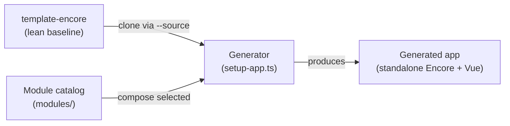

# Lean baseline plus compose

The `acme-vue-encore` generator materializes applications using a model called "lean baseline plus compose." It clones a lean baseline application and composes declarative modules into it at generation time. The result is a complete, standalone application with no generator dependency.

## The model

1. **Clone the baseline**: `setup-app.ts` copies the `template-encore` lean baseline into the destination, excluding template-governance machinery (specs, scripts, standards, tools, `.derived/`, `.claude/`).
2. **Select the auth driver**: the profile sets `AUTH_DRIVER` in the destination's `.env.example` and binds the matching secrets.
3. **Compose modules**: for each selected module, the composition engine copies service directories, merges migrations, binds secrets, merges CORS entries, and updates package dependencies.
4. **Regenerate the typed client**: when the Encore CLI is available, the generator invokes `encore gen client` against the destination.

## Why compile-time composition

Encore's service model is compile-time and filesystem-based. Services are discovered from `encore.service.ts` files in the directory tree; there is no equivalent of a runtime `app.use(...)` chain or a priority-sorted driver registry to populate. Generating a runtime loader would produce a non-Encore artifact.

Instead, the generator copies service directories and merges declarative config files. The Encore compiler sees a complete, static tree and resolves the graph without any generated intermediary. This also means the generated application has no generator dependency: it is a plain Encore app that boots and builds on its own.

There is no `registerAllModules(app)` call to generate. The copied service directories are the composition.

## The born-with policy

The carry-forward policy (`scripts/lib/born-with.ts`) decides what a produced app is born with and what stays behind:

| Born with (travels to the app) | Stays behind (generator-only) |
|-------------------------------|-------------------------------|
| The governance kernel (spec-spine config) | The generator scripts |
| The application code and services | The module catalog |
| The spec corpus relevant to the app | The generator meta-specs |

A generated application is self-sufficient: it carries its own governance surface and can be developed independently of the factory.

## Profiles

The generator supports three single-app profiles and one dual-app mode:

| Profile | Auth driver | Modules | Use case |
|---------|-------------|---------|----------|
| `minimal` | mock | none | Local development; mock login only |
| `public` | rauthy OIDC | none | External-facing application |
| `internal` | rauthy OIDC | user-management | Staff-facing application |
| `dual` | rauthy OIDC | none | Two independent apps (public + internal) |

The `dual` profile runs `setup-dual-app.ts`, which produces two independent Encore applications with separate databases, deployments, and scale boundaries. It does not compose `--with` modules.

## Cross-repo lockstep

Because the generator clones an external baseline, it must not drift from the app invariants frozen there. A committed lockfile (`baseline.lock.json`) pins the `template-encore` ref, the baseline core services, the module catalog membership, and the SHA-256 of the frozen app-invariant specs. The lockstep gate (`npm run lockstep`) and the `ci-lockstep` workflow fail visibly on any upstream drift.
