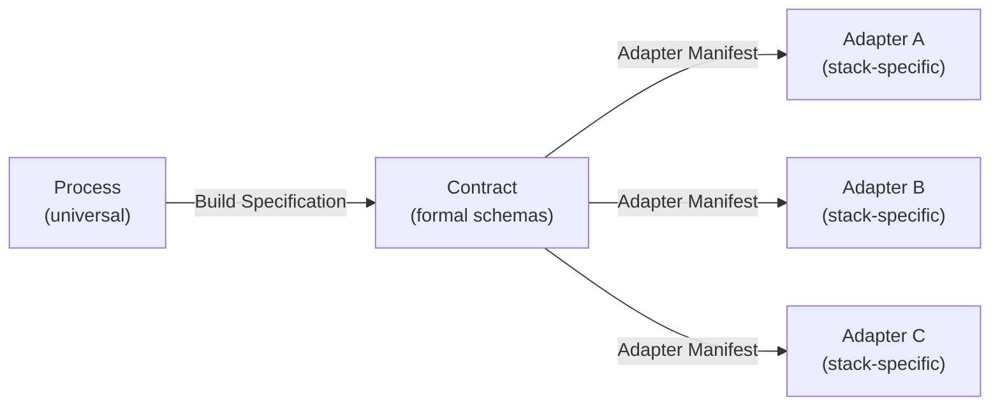

# Three-layer architecture

The central design principle of factory-encore is a strict separation between three layers. Each layer has a single responsibility, and the boundaries between them are enforced by formal schemas. This separation is what lets one pipeline target any stack and lets a new stack arrive without touching the pipeline.

## Process layer

The process layer (`process/`) is universal and technology-agnostic. Its pipeline stages read business documents and produce structured, technology-free specifications. The process reasons about entities, use cases, rules, audiences, pages, and operations. It never names a framework, a language, or a file path.

The process layer:

- Runs requirement analysis, service design, data modeling, and API/UI specification.
- Produces a Build Specification (not code).
- Enforces cross-stage consistency at validation gates.
- Persists durable pipeline state for resumability.

## Contract layer

The contract layer (`contract/`) is the formal interface between process and implementation. Five schemas define the shapes that cross the boundary:

| Schema | Purpose |
|--------|---------|
| **Build Specification** | The factory's output: what resources exist, what operations are available, what pages display them, what rules govern them. Completely technology-free. |
| **Adapter Manifest** | What an adapter declares: its stack, capabilities, supported auth methods, build commands, directory conventions, agents, and pattern locations. |
| **Verification Contract** | What must pass at each gate: pre-flight checks, per-stage gates, scaffolding gates, and final validation. |
| **Pipeline State** | Durable execution state for resumability: stage progress, scaffolding status, verification results, and an audit trail. |
| **Governance Envelope** | The admission brief a process files: its objective class, ceilings, human-in-the-loop gate predicates, and the artifacts it emits. |

The contract is an open standard. Its canonical home is the [Open Agentic Platform](https://github.com/statecrafting/open-agentic-platform) repository; this repository mirrors specific versions (Build Spec and Adapter Manifest at 1.1.0; Verification, Pipeline State, and Governance Envelope at 1.0.0). The schemas are not authored here and should not be edited locally.

## Adapter layer

The adapter layer (`adapters/`) holds pluggable implementations, one per technology stack. An adapter is self-contained:

- A `manifest.yaml` declaring its capabilities, conformant to the Adapter Manifest schema.
- `agents/` with focused code-generation agent prompts.
- `patterns/` with concrete code-generation patterns the agents follow.
- Validation invariants checked during final verification.

Adding a stack means adding an adapter. The process and contract layers never change.

## Why the boundary matters

The formal contract between process and adapter is what makes the architecture extensible:

Because the process never references technology and the adapter never touches the process, you can:

- Run the same pipeline against different stacks by swapping the adapter.
- Add a new stack without modifying any existing code in `process/` or `contract/`.
- Validate that an adapter satisfies a run's requirements at pre-flight, before any scaffolding begins.

## The shipped adapter

One adapter ships with the repository: **`acme-vue-encore`** (Encore.ts + Vue 3 / PrimeVue / rauthy OIDC). It is also the create-time home of that product, carrying the deterministic generator, the module catalog, and the from-Build-Spec orchestration. The generator is stack-specific code that lives entirely within `adapters/acme-vue-encore/`; it does not belong to the process or contract layers.
