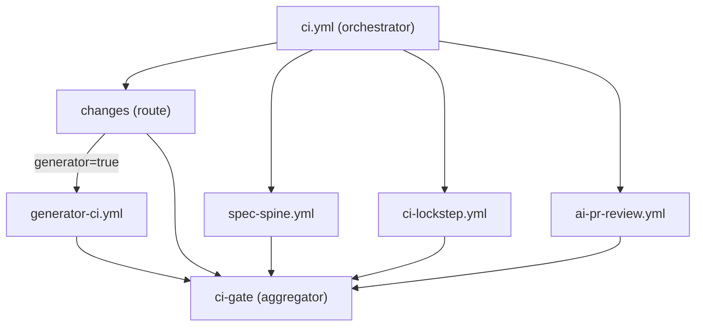

# CI and gates

The CI surface is governed by spec 000 (factory kernel). Branch protection's single required check on `main` is the terminal `ci-gate` job. Every other gate is a reusable (`workflow_call:`) workflow dispatched from `ci.yml`.

## Workflow topology



## Routing

A `changes` job runs an inline `git diff` against the PR base and emits one boolean per routed workflow. No third-party action is used for path detection.

| Route | Trigger paths | Behavior |
|-------|--------------|----------|
| `generator` | `adapters/**`, `package.json`, `tsconfig.json`, `vitest.config.ts`, `.github/workflows/generator-ci.yml` | Runs the generator test gate. |

On `merge_group` or `workflow_dispatch`, routes fall back to `true` (no base to diff) and the full suite runs.

## Constitutional gates (always-on)

These gates are never path-filtered and run on every PR:

### spec-spine.yml

The governance gate:

1. `spec-spine compile` — builds the spec registry.
2. `spec-spine lint --fail-on-warn` — corpus conformance.
3. `spec-spine index check` — codebase index staleness.
4. `spec-spine couple --base origin/<base-ref>` — PR-time coupling gate (PR-only).

The coupling gate reads the PR body for `Spec-Drift-Waiver:` escape-hatch lines.

### ci-lockstep.yml

The cross-repo lockstep gate. Validates the committed `baseline.lock.json` against the current `template-encore` state.

## Routed gates

### generator-ci.yml

The generator test gate (routed on the generator surface):

1. `npm run typecheck` — TypeScript strict-mode check.
2. `npm test` — vitest unit + integration tests.

## AI PR review

The AI PR review (`ai-pr-review.yml`) runs on PRs only and is folded into the `ci-gate`. It follows the resilient pattern:

| Scenario | Behavior |
|----------|----------|
| Review completes | Normal pass/fail. |
| Claude API transient failure (5xx, timeout, rate-limit) | **Pass** with a visible PR notice (never a silent green). |
| Auth/permission error | **Hard failure** (a broken token must be fixed). |
| Oversized diff | **Skip** with a visible PR notice. |

## The ci-gate aggregator

The terminal `ci-gate` job:

- `needs:` all upstream jobs (changes, generator, spec-spine, lockstep, ai-review).
- Treats `skipped` as success (path-filter said "don't run").
- Fails on any upstream `failure` or `cancelled`.
- Is the single required check for branch protection on `main`.

## Security: SHA-pinned actions

Every external `uses:` in the workflow surface is SHA-pinned (not tag-pinned). This prevents supply-chain attacks via tag mutation.

## Local CI

Run the full local gate set with:

```bash
make ci
```

This executes governance (compile, lint, index check), typecheck, vitest, and the lockstep check.
