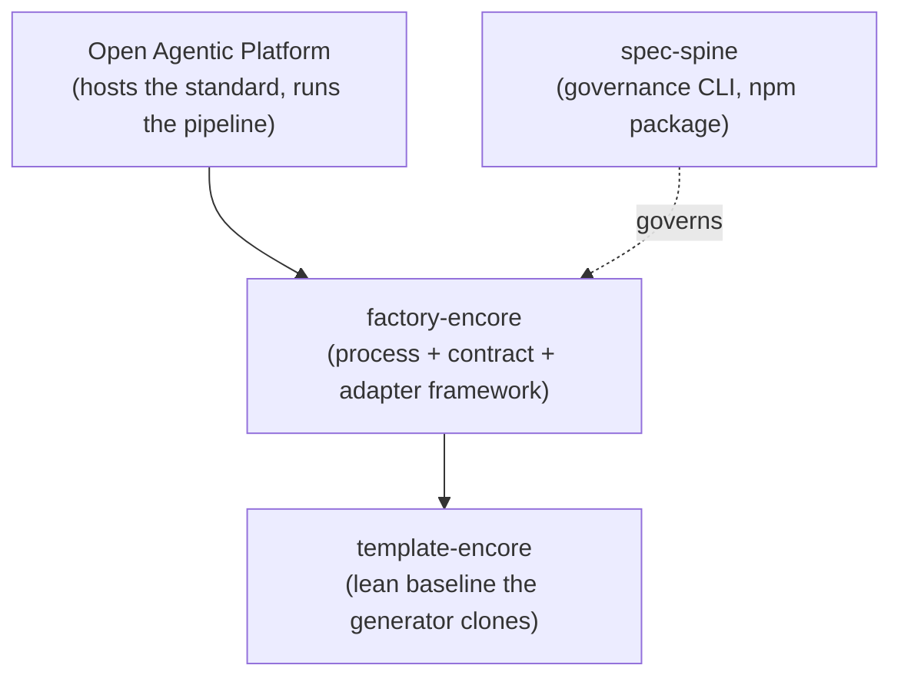

# Overview

`factory-encore` is a technology-agnostic software factory framework. It separates the **process** of building software (requirements, design, specification) from the **implementation** (frameworks, languages, code patterns) by placing a formal **contract** between them. One pipeline can target any stack, and a new stack arrives without touching the pipeline.

## What factory-encore is

The repository is an original, independent implementation of the [Open Agentic Platform](https://github.com/statecrafting/open-agentic-platform) (OAP) factory standard. The five contract schemas mirror OAP's published standard; the process layer and documentation are authored here. Released under Apache-2.0.

## The three layers

The architecture is built on three layers separated by formal interfaces:

| Layer | Location | Responsibility |
|-------|----------|----------------|
| **Process** | `process/` | Universal pipeline stages that transform business documents into a Build Specification. Never names a framework or language. |
| **Contract** | `contract/` | Five formal schemas defining the boundary between process and implementation. |
| **Adapter** | `adapters/` | Pluggable, technology-specific implementations. One per stack. |

The process turns business documents into a structured, frozen Build Specification; an adapter turns that specification into a running application. The contract defines what crosses the boundary.

## The create-time generator home

Beyond the universal layers, this repository is also the **create-time home** of one shipped adapter: `acme-vue-encore` (Encore.ts + Vue 3 / PrimeVue / Pinia / PostgreSQL / rauthy OIDC). That adapter carries:

- A **deterministic generator** (`scripts/`) that materializes applications from the `template-encore` lean baseline.
- A **module catalog** (`modules/`) of composable service modules.
- **From-Build-Spec orchestration** (`orchestration/`) for create-time agentic workflows.

Because it carries governed code, the repository has a **spec-spine governance kernel** (`specs/`, `standards/`, `spec-spine.toml`) and a **CI surface** whose terminal `ci-gate` aggregates governance, generator tests, a cross-repo lockstep, and an AI PR review.

## Where it sits in the ecosystem

- **OAP** is the host platform. It publishes the canonical contract schemas and provides the dispatch surface. factory-encore implements the factory standard OAP defines.
- **template-encore** is the lean baseline application. The generator clones it via `--source` and composes modules in; a cross-repo lockstep (spec 006) pins the ref and the frozen app-invariant spec hashes.
- **spec-spine** is the published npm governance CLI (`spec-spine@0.8.0` in devDependencies). It compiles the spec registry, lints the corpus, builds the codebase index, and runs the PR-time coupling gate.

## Key principles

1. **The factory never generates code.** The process produces a Build Specification. Adapters generate code.
2. **Each agent has bounded context.** No agent holds the whole pipeline in memory; each reads one specification slice and one pattern.
3. **Validation is automated, not self-assessed.** The adapter declares build/test/lint commands; a verification harness runs them.
4. **Build, test, fix loops.** Each feature is scaffolded, verified, and retried, not batch-generated.
5. **Durable state enables resumability.** Pipeline state is persisted after each step; recovery reads state and continues from the last checkpoint.
